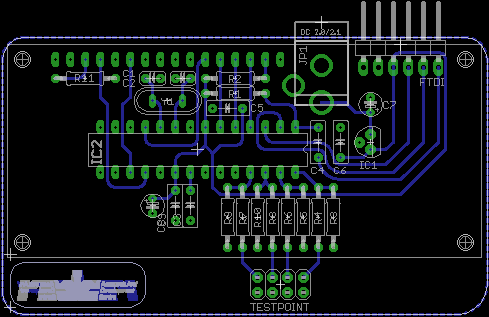

ATmega328p 4Ch DC Voltmeter
============================

This repository contains the eagle schematic and board for ATmega328P 4 Channel DC Voltmeter.
You could also use ATmega8 because the firmware size is only around 4kB. The board itself only
supplied with FTDI header for programming, so you should provide ATmega chip with bootloader or
preprogrammed chip.

References
==========

* [Starting Electronics: Arduino LCD Voltmeter with 4 Channels](http://startingelectronics.com/projects/arduino-projects/arduino-4-channel-LCD-voltmeter/ "Starting Electronics: Arduino LCD Voltmeter with 4 Channels")
